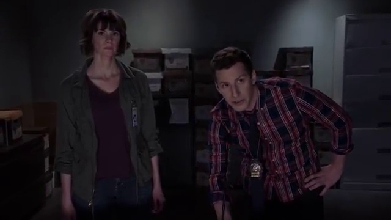

# Shot Boundery Detection by VGG16 vetcor Cloustering

Here we gona detect some Scenes from random video and choose an frame to represent it's content.

[ Sample video here!](https://youtu.be/ffyKY3Dj5ZE) 

## 1. Extract frames from fideo...

* OpenCV

## 2. Extract fieatures from frames...

* VGG16

## 3. Cluster frames by feeature arrays into scene classes...

* Kmeans

## 4. Find the most frequently shown scene class...

* Just Counting

## 5. Choose the middle frame from main scene class...

 